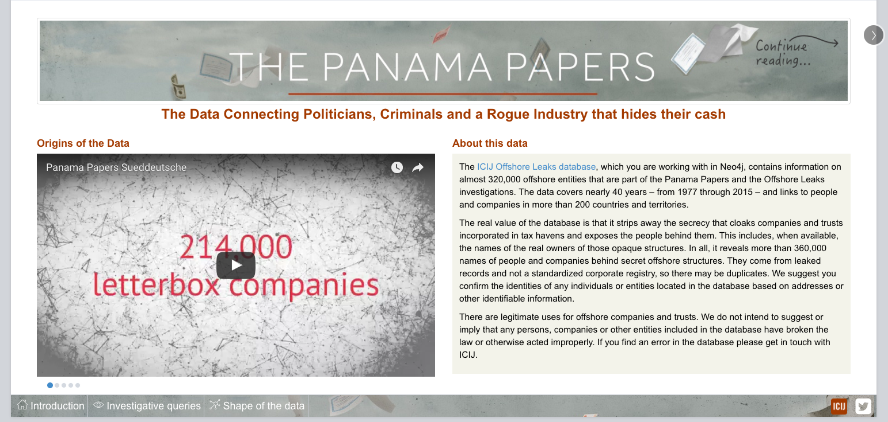
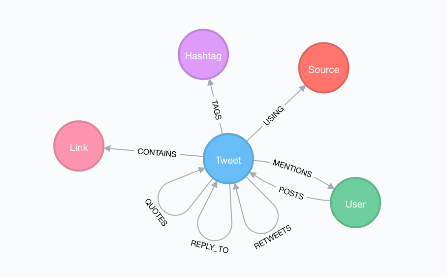
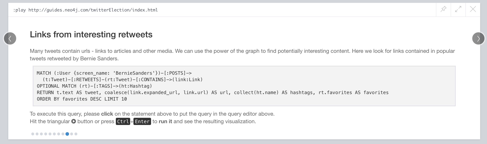
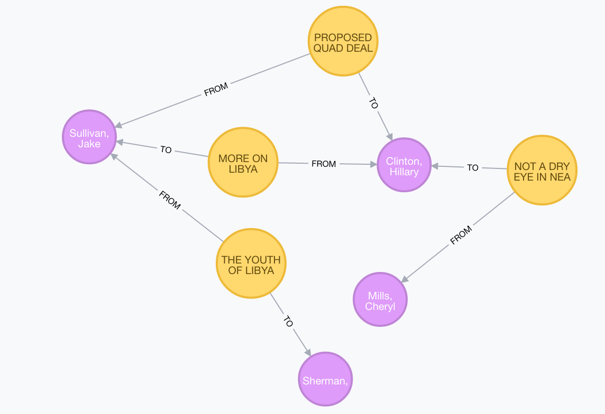
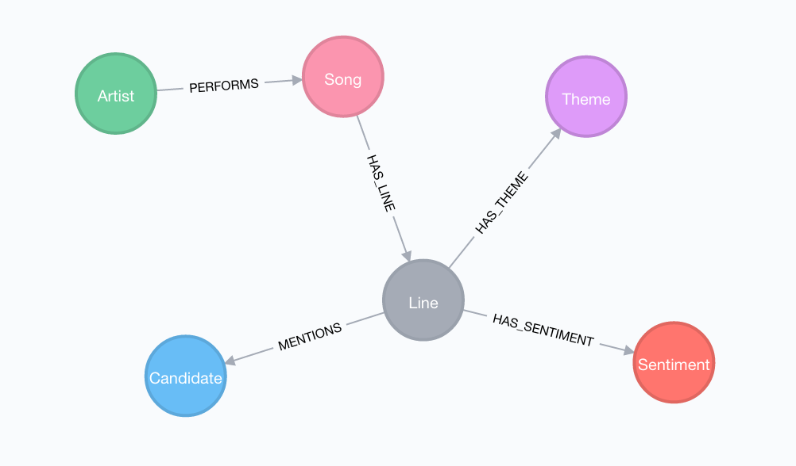
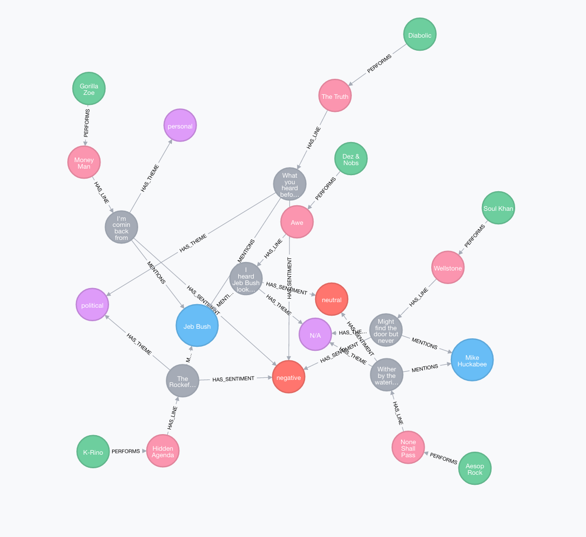

# Graph Hack 2016

## TLDR

* Build something cool with Neo4j
* Register your project and team [here](https://hackdash.org/dashboards/graphssf)
* Present your project 
* Win cool prizes

## Overview

### Schedule

|               |                       |
| --------------| ---------------------------------|
| 4:00pm-4:30pm | Arrive                           |
| 4:30pm-5:00pm | Project pitches                  |
| 5:00pm-5:30pm | Teams form                       |
| 5:30pm-9:00pm | Hacking                          |
| 6:00pm        | Food and Drinks served           |
| 9:00pm-9:45pm | Project presentations            |
| 10:00pm       | Prize announcements              |
| 10:00pm       | Bar closes (keynote is early!)   |

### Rules

Teams!
* Teams are encouraged, but individual participation is allowed.
* Teams may have up to 4 participants. 
* Register your project and all team mates [here](https://hackdash.org/dashboards/graphssf)

Winners
* 1st place team
* 2nd place team
* 3rd place team
* Honorable mentions team(s)

Criteria for judging - all projects must use Neo4j
* Creativity (perhaps including merging disparate data sources)
* Use of Cypher and Neo4j
* Interesting new information uncovered
* Quality of presentation (perhaps including visualization)
* Completeness

Prize Distribution
* A variety of prizes will be on display throughout the event
* Each member of winning teams may choose (1) prize
* First place team will be announced and choose prizes first, followed by 2nd place team, followed by 3rd place team
* As long as prize inventory allows, honorable mention teams will be announced and be able to choose prizes
* Each prize is limited in quanity. Within each winning team, individuals will need to decide who gets which prize.

### Prizes

* Amazon Echo (x2)
* Amazon Echo Tap (x2)
* SmartThings Home Automation Kit (x2)
* Sphero BB-8 droids (x2)
* GoPro Hero 5 session (x2)
* Lumio Mini 
* Neo4j [Rhapsody Bluetooth Headphones](http://www.promotionalspeakers.com/wrapsody) (x4)
* Neo4j [Aurabox LED display and Bluetooth Speaker](http://www.promotionalspeakers.com/aurabox-c107c) 
* Neo4j water bottles (x10)
* Neo4j umbrellas (x10)

## Datasets

### Panama Papers + (Offshore Leaks + Bahamas Leaks)

* [Download from ICIJ Offshore Leaks](https://offshoreleaks.icij.org/pages/database)

*NOTE: This dataset has an interactive Neo4j Browser guide for exploring the data:*

### Legis-graph (US Congress)

* [Github repository](https://github.com/legis-graph/legis-graph)
* [Quickstart import from your web browser](http://johnymontana.github.io/LazyWebCypher/?file=https://raw.githubusercontent.com/legis-graph/legis-graph/master/quickstart/114/legis_graph_import_114.cypher)
* `:play http://guides.neo4j.com/legisgraph`

### Campaign Finance - FEC Filings

* `:play http://guides.neo4j.com/legisgraph/fecimport.html`

### US Election Data

#### Election Tweets

*Download*
~~~
wget http://demo.neo4j.com.s3.amazonaws.com/electionTwitter/neo4j-election-twitter-demo.tar.gz
tar -xvzf neo4j-election-twitter-demo.tar.gz
cd neo4j-enterprise-3.0.3
bin/neo4j start
~~~

*[Or use hosted instance](http://bit.ly/trumptweetsneo4j)

*NOTE: This dataset has an interactive Neo4j Browser guide for exploring the data:*

#### Election Forecast

Fivethirtyeight has made the data behind their famous election forecast publicly available:

[http://projects.fivethirtyeight.com/2016-election-forecast/summary.json](http://projects.fivethirtyeight.com/2016-election-forecast/summary.json)

You can easily pull this into Neo4j using [apoc.load.json]():

~~~
CALL apoc.load.json("http://projects.fivethirtyeight.com/2016-election-forecast/summary.json") YIELD value AS data
RETURN data
~~~

### Hillary Clinton's Emails

~~~
// Creating the graph
USING PERIODIC COMMIT
LOAD CSV WITH HEADERS FROM "https://s3-us-west-2.amazonaws.com/neo4j-datasets-public/Emails-refined.csv" AS line
MERGE (fr:Person {alias: COALESCE(line.MetadataFrom, line.ExtractedFrom,'')})
MERGE (to:Person {alias: COALESCE(line.MetadataTo, line.ExtractedTo, '')})
MERGE (em:Email { id: line.Id })
ON CREATE SET em.foia_doc=line.DocNumber, em.subject=line.MetadataSubject, em.to=line.MetadataTo, em.from=line.MetadataFrom, em.text=line.RawText, em.ex_to=line.ExtractedTo, em.ex_from=line.ExtractedFrom
MERGE (to)<-[:TO]-(em)-[:FROM]->(fr)
MERGE (fr)-[r:HAS_EMAILED]->(to)
ON CREATE SET r.count = 1
ON MATCH SET r.count = r.count + 1;
~~~

~~~
// Updating counts
MATCH (a:Person)-[r]-(b:Email) WITH a, count(r) as count SET a.count = count;
~~~

### Fivethirtyeight

The Fivethirtyeight teams does an amazing job of providing the data behind many of their stories in their [Github repo](https://github.com/fivethirtyeight/data). There are a lot of possibilities but here are a few ideas we hacked up:

#### `hip-hop-candidate-lyrics`

*Import*

~~~
LOAD CSV WITH HEADERS FROM "https://raw.githubusercontent.com/fivethirtyeight/data/master/hip-hop-candidate-lyrics/genius_hip_hop_lyrics.csv" AS row
MERGE (c:Candidate {name: row.candidate})
MERGE (a:Artist {name: row.artist})
MERGE (s:Sentiment {type: row.sentiment})
MERGE (t:Theme {type: row.theme})
MERGE (song:Song {name: row.song})
MERGE (line:Line {text: row.line})
SET line.url = row.url
MERGE (line)-[:MENTIONS]->(c)
MERGE (line)-[:HAS_THEME]->(t)
MERGE (line)-[:HAS_SENTIMENT]->(s)
MERGE (song)-[:HAS_LINE]->(line)
MERGE (a)-[r:PERFORMS]->(song)
SET r.data = row.album_release_date
~~~

### Crime data

Many governments use the Socrata data portal software to make their data (i.e. crime, transportation, etc) available. This means that we can use `apoc.load.json` to import data directly from any Socrata site. For example, to import [San Francisco crime data](https://data.sfgov.org/):

~~~
CALL apoc.load.json("https://data.sfgov.org/resource/cuks-n6tp.json?$limit=5000&$offset=0") YIELD value AS crime
MERGE (c:Crime {incidntnum: crime.incidntnum})
ON CREATE SET c.address=crime.address, c.time=crime.time, c.dayofweek=crime.dayofweek
MERGE (cat:Category {name: crime.category})
CREATE (c)-[:HAS_CATEGORY]->(cat)
MERGE (dis:District {name: crime.pddistrict})
CREATE (c)-[:OCCURRED_IN]->(dis);
~~~

### Other resources

Beyond the resources listed above.

We don't have Neo4j import scripts or graph exports for these, but we think they might be interesting to explore:

* [Deep and interesting datasets for computational journalism](http://cjlab.stanford.edu/2015/09/30/lab-launch-and-data-sets/)
* [US Government's open data](http://www.data.gov/)
* [NASA's Data Portal](https://data.nasa.gov/)
* [US City Data](http://us-city.census.okfn.org/)
* [US Spending data](https://www.usaspending.gov/Pages/default.aspx)
* [SF Open Data](https://data.sfgov.org/)

## Resources

### Neo4j

You'll need to use Neo4j to participate in the hackathon. You can download Neo4j [here](http://neo4j.com/download) or use one of the hosted versions above.

* [Neo4j Developer Page](https://neo4j.com/developer/)
* [Neo4j Get Started](https://neo4j.com/developer/get-started/)

### APOC - Awesome Procedures on Cypher

Graph algorithms, data import, job scheduling, full text search, geospatial, ...

* [Github page](https://github.com/neo4j-contrib/neo4j-apoc-procedures)
* [APOC Documentation](https://neo4j-contrib.github.io/neo4j-apoc-procedures/)

### Neo4j Folks

Grab your friendly Neo4j staff and community members if you have *any* questions.
